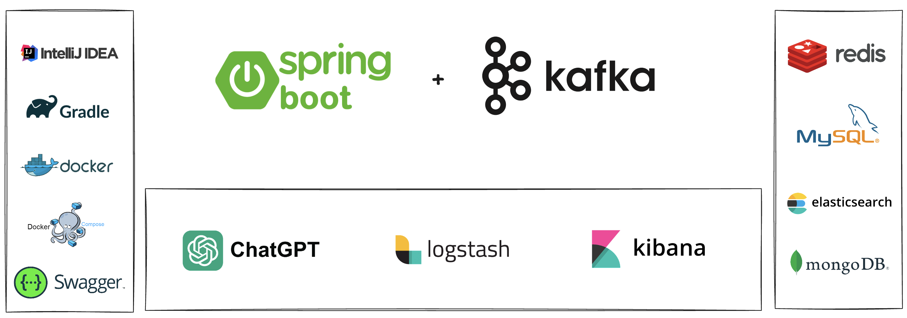
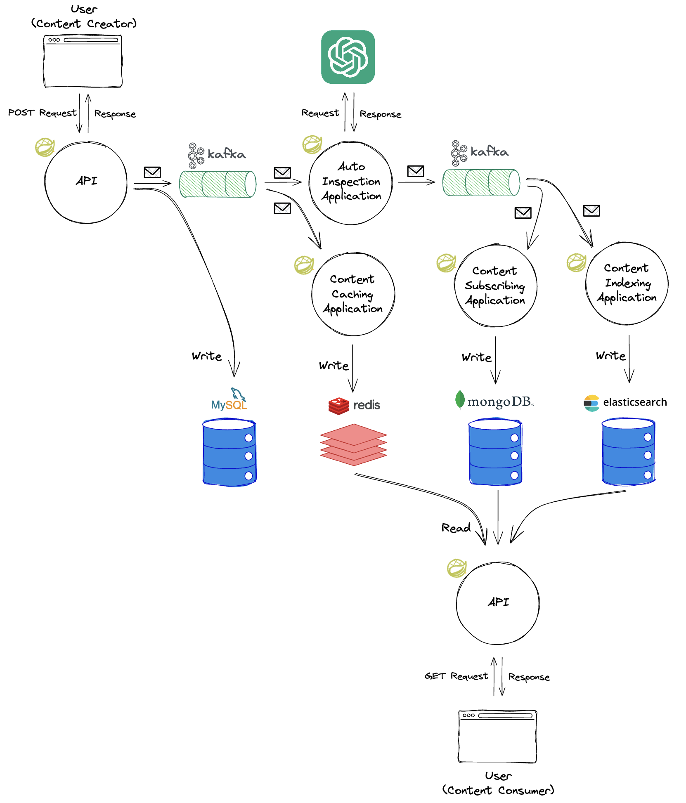
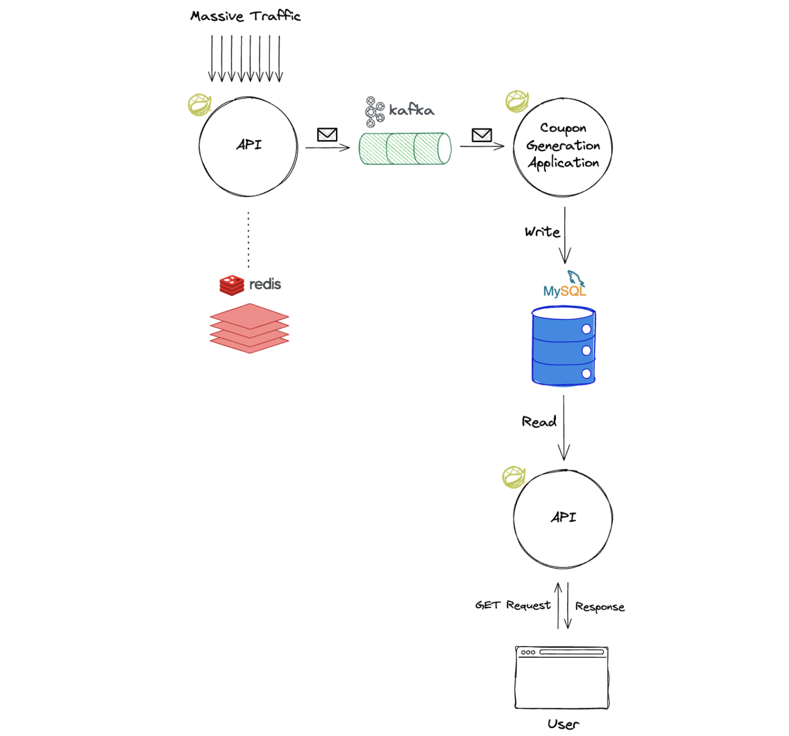
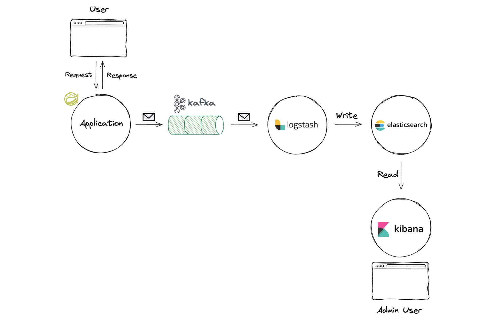

Fast Campus [한번에 끝내는 Kafka Ecosystem](https://fastcampus.co.kr/dev_online_newkafka) 강의의 Part 2-2. Event Driven Architecture 실습 교육용 자료입니다.

# Part 2-2. Event Driven Architecture 실습


**Kafka를 통한 Event Driven Architecture 실습을 주제로, 백엔드 개발자가 실무에서 Kafka를 백엔드 시스템 전반에 적용하는 Case Study 학습을 하기 위한 교육용 프로젝트입니다.**

[Part 2-1](https://github.com/HyunSangHan/fastcampus-kafka-message-queue)에서 다루었던 메시징큐 플랫폼 `Kafka`를 통해서 Micro Service 간의 비동기적인 데이터 전달이 이루어지면, 적절히 관심사 분리가 된 하나의 Event Driven Architecture가 점차 구축될 수 있게 됩니다. 이를 이번 파트인 Part 2-2에서 다루게 됩니다. (Kafka에 대한 경험이 없으신 분들은 반드시 Part 2-1 학습을 선행하시길 권장드립니다.)

총 3가지 Chapter로 구성되어 있으며, 각 Chapter는 비교적 독립적으로 진행될 예정이에요.

백엔드 개발자 중에서도, Java+Spring을 다루는 분들이 실무에 바로 적용하실 수 있도록 기본적으로 Spring Boot와 JDK 17 기준으로 프로젝트를 구성하고, 실무에서 Kafka와 함께 다룰 만한 여러가지 DB, 서비스들과의 다양한 조합으로 실습을 구성했어요. 그리고 ChatGPT API도 활용해 볼 예정이에요.

이번 파트에서는 MySQL, Elasticsearch, MongoDB, Redis 등 데이터 저장소 뿐만 아니라, Elastic Stack에 포함되는 Logstash와 Kibana, Beats도 다루게 되면서 그간 다뤄보신 적 없던 기술들도 실무에서 어떤 목적과 방식으로 사용되는지 간접 경험을 하실 수 있으리라 기대해요.

이 다양한 기술들 모두 Docker의 도움을 받아 간단하게 로컬에서 실습해볼 수 있으니 걱정마세요.

아래 내용들은 수업 진행 방향 및 실습 진행 속도에 따라 유동적일 수 있어요.

---

## 콘텐츠 플랫폼 구축 (Ch. 1)
UGC(User Generate Content) 플랫폼 전체를 Kafka를 이용한 Event Driven Architecture 형태로 설계하고 직접 구현해보는 프로젝트입니다.

하나의 콘텐츠가 발행되면 백엔드 시스템에서는 그 데이터를 다양하게 처리해야 하는데요. 그러한 관심사가 적절히 애플리케이션 단위로 분리되고 비동기적으로 데이터가 연동되어 마침내 소비까지에 이르는, 하나의 온전한 사이클을 경험해보실 수 있어요.

**Ch 1. Kafka를 활용한 콘텐츠 플랫폼 구축하기**
- MySQL에 콘텐츠 원천데이터 저장 및 Kafka Produce
- ChatGPT API를 활용한 콘텐츠 자동검수 시스템 구축 및 검수결과 Kafka Produce
- MongoDB에 구독 콘텐츠 저장 및 피드 서비스 노출
- Redis 캐싱 레이어 구축 및 콘텐츠 캐싱 실시간 갱신
- Elasticsearch에 콘텐츠 실시간 색인 및 검색 서비스 노출

### API Lists
- createContent (콘텐츠 신규 등록하기)
- updateContent (콘텐츠 수정하기)
- deleteContent (콘텐츠 삭제하기)
- getContentDetail (콘텐츠 상세 조회하기)
- searchContent (콘텐츠 검색해서 목록 조회하기)
- listSubscribedContent (콘텐츠 구독목록 조회하기)

### 사용되는 기술 스택
Kafka, Spring Boot, Java 17, Spring Data JPA, Mysql, Redis, MongoDB, Elasticsearch, Gradle, Docker, Docker Compose

### 그 외 사용되는 도구

- ChatGPT API ([`gpt-3.5-turbo`](https://platform.openai.com/docs/models/gpt-3-5-turbo))

### 구조도


## 선착순 쿠폰 발행 이벤트 대응 (Ch. 2)

특정 시간에 선착순 이벤트를 오픈해서, 쿠폰을 발행하는 이벤트 상황을 가정하고 실습해보는 프로젝트입니다.
대량의 트래픽이 짧은 순간에 쏟아져 들어올 때, SPOF(Single Point Of Failure)가 되지 않도록 하기 위해 Kafka를 유용하게 사용할 수 있어요.

**Ch 2. Kafka를 활용한 선착순 쿠폰 발행 이벤트 대응하기**
- 발생할 수 있는 문제 상황 예측
- 문제 상황을 해결하기 위한 방법

### API Lists
- issue (쿠폰 발행하기)
- listUsableCoupons (사용 가능한 쿠폰목록 조회하기)

### 사용되는 기술 스택
Kafka, Spring Boot, Java 17, Spring Data JPA, Mysql, Redis, Gradle, Docker, Docker Compose

### 구조도


## 실시간 로그 수집 파이프라인 구축 (Ch. 3)
Kafka를 활용해서 로그를 실시간으로 수집하는 파이프라인을 구축해보는 프로젝트입니다.

로그라는 데이터의 특성상, 동기적으로 처리될 필요까지는 없는 한편, 가급적 유실이 되지 않게 관리하는 것이 중요해요. 그런 점에서 Kafka의 장점과 궁합이 잘 맞기 때문에 Kafka는 로그 적재를 위해서도 많이 쓰이고 있어요. 적재된 로그는 Elastic Stack으로 활용도를 한층 높일 수 있기 때문에, Kafka + Elastic Stack은 로그 수집 파이프라인에서 많이 쓰이는 조합이랍니다.

**Ch 3. Kafka와 Elastic Stack을 활용한 실시간 로그 수집 파이프라인 구축하기**
- Filebeat를 통한 로그 수집
- Logstash를 통한 입출력 프로세싱
- Elasticsearch에 색인
- Kibana에서 로그 시각화
- 로그 연동해보기

### 사용되는 기술 스택
Kafka, Spring Boot, Java 17, Elastic Stack(Elasticsearch, Logstash, Kibana, Filebeat), Gradle, Docker, Docker Compose

### 구조도


---

## Execution
```
./gradlew docker
docker-compose up -d
```

## Endpoints
- Swagger
  - http://localhost:8080
- Kafka
  - http://localhost:9092
- Kafka UI
  - http://localhost:8989
- Mysql
  - http://localhost:3306
  - root password: `1234`
  - database: `campus`
  - User/PW: `myuser`/`mypassword`
- MongoDB
  - http://localhost:27017
- Redis
  - http://localhost:6379
- Elastic Stack
  - Elasticsearch
    - http://localhost:9200
  - Kibana
    - http://localhost:5601

## Troubleshooting

### 1. Elasticsearch 사용 시 디스크 용량 초과로 커맨드 실행이 잘 되지 않는 경우
```sh
curl -XPUT -H "Content-Type: application/json" http://localhost:9200/_cluster/settings -d '{ "transient": { "cluster.routing.allocation.disk.threshold_enabled": false } }'
curl -XPUT -H "Content-Type: application/json" http://localhost:9200/_all/_settings -d '{"index.blocks.read_only_allow_delete": null}'
```
